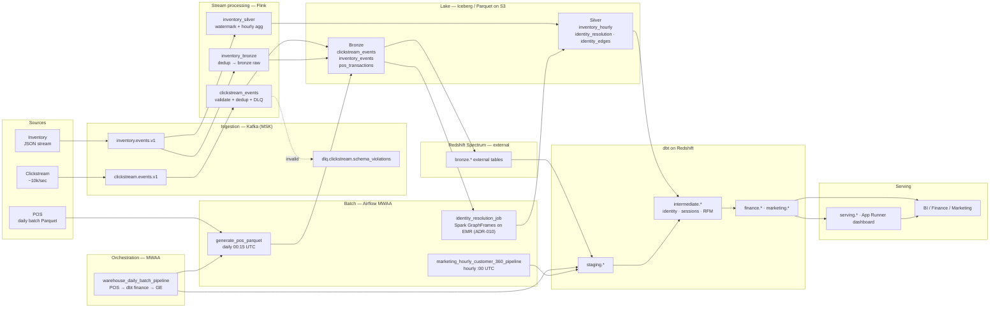

# Architecture Decision: Global Retail Analytics Platform

## Problem Statement

Three siloed data sources must power three distinct use cases with

conflicting latency, cost, and complexity requirements:

| Source | Characteristics | Use Case |

|---|---|---|

| POS transactions | Relational, daily snapshots | Finance fact table (T+8hr) |

| Inventory system | Real-time JSON stream | Operational inventory (batch Gold dashboard) |

| Marketing clickstream | Event logs, 10k/sec peak | Customer 360 (hourly dbt) |

---

## Architecture Diagram

End-to-end flow from the three sources through each storage layer to the

serving tables. Table names match the Redshift DDL (`transformation/redshift/`)

and dbt models (`transformation/dbt_project/`).

## Layer Definitions

**Bronze:** Raw, append-only, schema-on-read. Full fidelity. Iceberg on S3.

Invalid clickstream rows route to Kafka DLQ topics (see `clickstream_bronze_job.py`).

Retention: 90 days Standard, 1yr IA, 3yr+ Glacier via Intelligent-Tiering.

**Silver:** Cleaned, deduplicated, schema-enforced. Iceberg on S3 (MoR for

inventory upserts). Flink writes `silver.inventory_hourly`; dbt marts rebuild

inventory facts from **bronze** `inventory_events` (Spectrum) by design.
The Spark GraphFrames job (ADR-010) writes `silver.identity_resolution` +
`silver.identity_edges` hourly from bronze clickstream + POS.

Clickstream has no separate silver table — bronze feeds dbt directly.

**Gold:** Business-ready, Kimball dimensional model. Redshift tables (bronze read

via Spectrum over S3). Finance on **daily** batch; Customer 360 on **hourly** batch.
Gold marts ship with Write-Audit-Publish ([ADR-009](docs/decisions/ADR-009-write-audit-publish.md)):
live Gold is cloned into `finance_pending` / `marketing_pending` /
`summary_pending`, dbt rebuilds tables there, dbt tests + GE audit the pending
copies, and an atomic rename promotes the DAG-owned set to live only on success.
`marketing.dim_product` is catalog-owned; warehouse facts join the live table.
A failing run never touches the tables consumers read.

**Summary:** Reusable daily rollups in schema `summary.*`, each from **one** Gold

fact (no fact-to-fact joins). See `docs/data-model/platform-layers.md`.

**Serving:** App Runner dashboard reads **Gold** tables on Redshift (and local

Iceberg in dev). A dedicated Redis sub-5s path is **deferred** (see ADR-002).

**Metadata:** Separate Redshift database `metadata` (`meta.*`) for catalog,

pipeline runs, freshness, and DQ history — same workgroup, not Glue. See ADR-008.

---

## Technology Choices (Summary)

| Layer | Technology | Rationale |

|---|---|---|

| Message bus | Kafka (MSK) | Decouples producers from all consumers |

| Stream processing | Apache Flink on EMR | Stateful ops, exactly-once, watermarks |

| Graph processing | Spark GraphFrames on EMR | True connected components for identity (ADR-010) |

| Table format | Apache Iceberg | Engine-agnostic, schema evolution, multi-consumer |

| Data warehouse | Amazon Redshift Serverless | All-AWS, pay-per-use RPUs, Spectrum reads S3 in place (ADR-005) |

| Transformation | dbt Core | Version-controlled SQL, incremental models, lineage |

| Orchestration | Airflow (MWAA) | Daily finance + hourly marketing DAGs |

| Quality | GE + pytest | Column-level (GE) + set-level SCD2 (pytest) |

| IaC | Terraform | Reproducible infra, maps to existing team skills |

Full rationale per decision: see `docs/decisions/` ADRs.

---

## Latency SLAs (as implemented)

| Pipeline | Latency | Mechanism |

|---|---|---|

| Inventory → Bronze | < 30 seconds | Flink continuous → Iceberg |

| Inventory → Silver | < 10 minutes | Flink hourly snapshot job |

| Inventory → Dashboard | Batch (daily/hourly Gold) | App Runner → Redshift `fact_inventory_snapshot` |

| Clickstream → Bronze | < 30 seconds | Flink continuous → Iceberg + DLQ |

| POS → Gold (fact_sales) | T + 8 hours | `warehouse_daily_batch_pipeline` → dbt |

| Customer 360 refresh | < 75 minutes | `marketing_hourly_customer_360_pipeline` → dbt marketing marts |

> **Deferred:** Flink → Redis sub-5s inventory dashboard (ADR-002 original target).

> Revisit when operational SLA requires sub-minute store-floor actions.

---

## Cost Summary (100GB scale, ap-southeast-1)

| Component | Optimized Monthly Cost |

|---|---|

| S3 storage (all tiers) | $430 |

| Redshift managed storage | $100 |

| EMR / Flink (Spot) | $330 |

| Redshift Serverless compute (RPU) | $3,108 |

| MSK (Serverless) | $400 |

| Data transfer | $200 |

| Monitoring/misc | $100 |

| **Total** | **~$4,668** |

Redis ($80/mo) excluded until the sub-5s path is implemented.

Full model: [docs/decisions/ADR-004-cost-model.md](./docs/decisions/ADR-004-cost-model.md)

