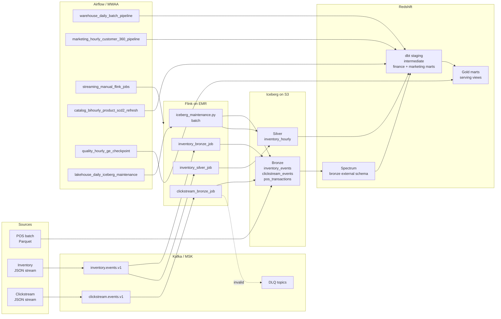

# Architecture: Global Retail Analytics Platform

This document is the current architecture authority for the repository.
Cursor-specific agent rules live in `.cursor/rules/*.mdc`; operational
procedures live in `docs/runbooks/`; detailed decisions live in
`docs/decisions/ADR-*.md`.

## Problem Statement

Three retail data sources must serve different latency and governance needs.

| Source | Shape | Primary use |
|---|---|---|
| POS transactions | Daily batch Parquet | Finance facts and reconciled reporting |
| Inventory events | Real-time JSON stream | Operational inventory and hourly snapshots |
| Clickstream events | High-volume event stream | Customer 360, sessions, RFM, consent-aware marketing |

The platform separates raw capture, streaming processing, dimensional modeling,
quality checks, and serving. One database is not asked to solve every problem.

## End-to-End Flow



## Layers

| Layer | Purpose | Implementation |
|---|---|---|
| Ingestion | Decouple producers/consumers and preserve event ownership | Kafka/MSK topics and JSON schemas |
| Bronze | Raw, replayable source history | Iceberg on S3; Spectrum external access |
| Silver | Cleaned or operational streaming outputs | Iceberg `silver.inventory_hourly` |
| Gold | Governed business marts | Redshift tables built by dbt (`finance.*`, `marketing.*`) |
| Summary | Reusable aggregates from one Gold fact | Redshift/DuckDB `summary.*` |
| Serving | Consumer-specific views and dashboard access | Redshift serving views, Streamlit/App Runner |
| Metadata | Ops catalog, pipeline runs, freshness, DQ history | Separate DB `metadata.meta.*` (same workgroup); local `local_metadata.duckdb` |
| Quality | Contract, model, and runtime checks | JSON schemas, dbt tests, GE, pytest, Airflow reconciliation |

See [docs/data-model/platform-layers.md](docs/data-model/platform-layers.md) and
[ADR-008](docs/decisions/ADR-008-metadata-database.md).

## Streaming Architecture

The streaming path uses Flink on EMR with YARN Per-Job isolation.

| Job | Input | Output | Notes |
|---|---|---|---|
| `inventory_bronze_job.py` | `inventory.events.v1` | `bronze.inventory_events` + inventory DLQ | Validate, dedup, preserve raw inventory stream |
| `inventory_silver_job.py` | `inventory.events.v1` | `silver.inventory_hourly` | Hourly event-time aggregation; single owner of inventory kappa path |
| `clickstream_bronze_job.py` | `clickstream.events.v1` | `bronze.clickstream_events` + clickstream DLQ | Validate, dedup, route invalid events visibly |
| `iceberg_maintenance.py` | Iceberg catalog | Optimized Iceberg tables | Batch maintenance job; no long-running state |

Production Flink defaults:

- RocksDB state backend with incremental checkpoints.
- `EXACTLY_ONCE` checkpointing and externalized checkpoints retained on cancellation.
- 30-second minimum pause between checkpoints.
- 7-day SQL state TTL.
- 1-minute source idle timeout.
- Kafka partition discovery every 5 minutes.

Reference: `docs/runbooks/flink-operations.md`.

## Kafka Architecture

Kafka is the event boundary, not the warehouse.

Core topics:

- `inventory.events.v1`
- `clickstream.events.v1`
- `dlq.events.v1`
- `dlq.clickstream.schema_violations`
- `dlq.clickstream.business_violations`
- `dlq.inventory.schema_violations`

POS is daily batch Parquet into Iceberg Bronze (`generate_pos_parquet.py`),
not a Kafka topic.

Producer defaults are configured in `ingestion/kafka/msk_config.py`:

- `acks=all`
- idempotence enabled
- bounded delivery timeout with large retry budget
- `max.in.flight.requests.per.connection=5`
- batching and `lz4` compression

Flink source offsets are checkpoint-managed with `enable.auto.commit=false`.
Consumer lag is monitored through MSK CloudWatch `PCTConsumerLag` alarms.

Reference: `docs/runbooks/kafka-operations.md`.

## Data Model

Gold is a Kimball-style Redshift model. Gold marts are delivered with
Write-Audit-Publish ([ADR-009](docs/decisions/ADR-009-write-audit-publish.md)):
live Gold is cloned into `finance_pending` / `marketing_pending` /
`summary_pending`, dbt rebuilds there, dbt tests + GE audit the pending copies,
and an atomic rename promotes to live only on success — a failing run never
touches the tables consumers read. Each Gold table has one owning DAG.

| Model | Grain |
|---|---|
| `finance.fact_sales` | One row per transaction line item |
| `finance.fact_inventory_snapshot` | One row per product, store, snapshot date, snapshot hour |
| `marketing.fact_customer_session` | One row per session |
| `marketing.dim_customer` | One row per customer |
| `marketing.dim_product` | SCD Type 2 product history |

Rules:

- Surrogate integer keys on facts and dimensions.
- SCD Type 2 only on `dim_product`.
- No fact-to-fact joins; use drill-across patterns.
- Enforce marketing consent before customer PII access.
- Data contract changes require schema version bumps.

Reference: `docs/data-model/dimensional-model.md`.

## Orchestration

Current Airflow DAGs:

| DAG | Purpose |
|---|---|
| `warehouse_daily_batch_pipeline` | POS Bronze, dbt finance/marts, Redshift ANALYZE, row-count reconciliation, GE |
| `marketing_hourly_customer_360_pipeline` | Identity graph, sessions, RFM, dim_customer, Customer 360 |
| `streaming_manual_flink_jobs` | Submit Flink jobs to EMR with duplicate-run guard |
| `catalog_bihourly_product_scd2_refresh` | Intra-day `dim_product` SCD2 refresh |
| `quality_hourly_ge_checkpoint` | Hourly `gold_layer_daily` GE checkpoint |
| `lakehouse_daily_iceberg_maintenance` | Submit Iceberg compaction and snapshot expiration job |

Reference: `docs/runbooks/dag-review-checklist.md`.

## Lakehouse Maintenance

Iceberg tables use low-cardinality daily partitioning:

- `bronze.inventory_events`: `event_date` (identity on CAST(event_time AS DATE))
- `bronze.clickstream_events`: `event_date` (identity on CAST(event_time AS DATE))
- `silver.inventory_hourly`: `snapshot_date_key`
- POS Spectrum table: `dt`

The maintenance DAG submits a Flink batch job that calls Iceberg maintenance
procedures for compaction and snapshot expiration. Redshift `ANALYZE` runs
after daily mart builds.

Reference: `docs/runbooks/iceberg-maintenance.md`.

## Deployment

Terraform has two stacks:

| Stack | Path | Purpose |
|---|---|---|
| `bootstrap` | `infra/terraform/bootstrap/` | State bucket, locks, budget |
| `platform` | `infra/terraform/` | S3, MSK, EMR, Redshift, MWAA, dashboard |

Use the wrapper:

```powershell
.\scripts\cloud\run_terraform.ps1 -Stack platform -Env dev -Action plan
.\scripts\cloud\run_terraform.ps1 -Stack platform -Env dev -Action apply
```

Runtime sync and Flink submission:

```powershell
.\scripts\cloud\deploy_platform.ps1 -Env dev
.\scripts\cloud\deploy_platform.ps1 -Env dev -Action airflow-vars
```

Never run raw Terraform inside a stack directory.

## Local Development

Local testing uses Docker, Kafka, Flink, Iceberg files, DuckDB, dbt, and pytest.

```powershell
.\scripts\local\run_local_stack.ps1 -Task up
.\scripts\local\run_local_stack.ps1 -Task topics
.\scripts\local\run_local_stack.ps1 -Task simulate
.\scripts\local\run_local_stack.ps1 -Task flink
python -m pytest tests/unit/ -q
```

Use `127.0.0.1:9092` from the Windows host for Kafka.

## Non-Goals and Deferred Paths

- No Delta/Hudi replacement for Iceberg.
- No SCD Type 2 dimensions beyond `dim_product`.
- No CSV POS staging path.
- No separate lean/redshift-dev Terraform stack.
- Sub-5-second Redis inventory serving remains deferred until the business SLA
  requires store-floor action in seconds.

## Key Runbooks

- `docs/runbooks/kafka-operations.md`
- `docs/runbooks/flink-operations.md`
- `docs/runbooks/iceberg-maintenance.md`
- `docs/runbooks/dag-review-checklist.md`
- `docs/runbooks/backfill-verification.md`
- `docs/runbooks/upstream-incident-response.md`
- `docs/runbooks/dw-checklist-audit.md`
