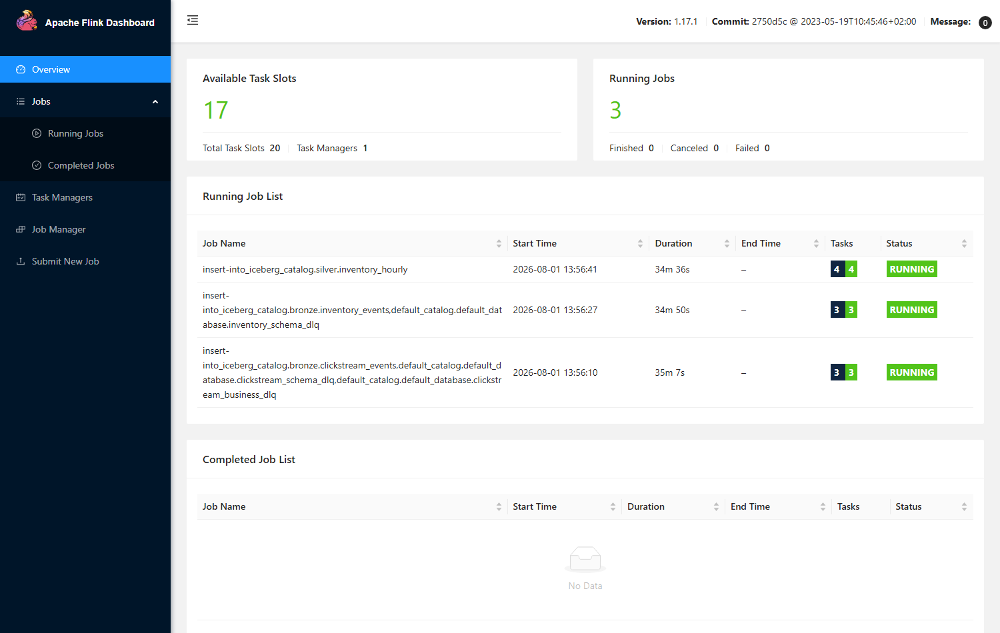
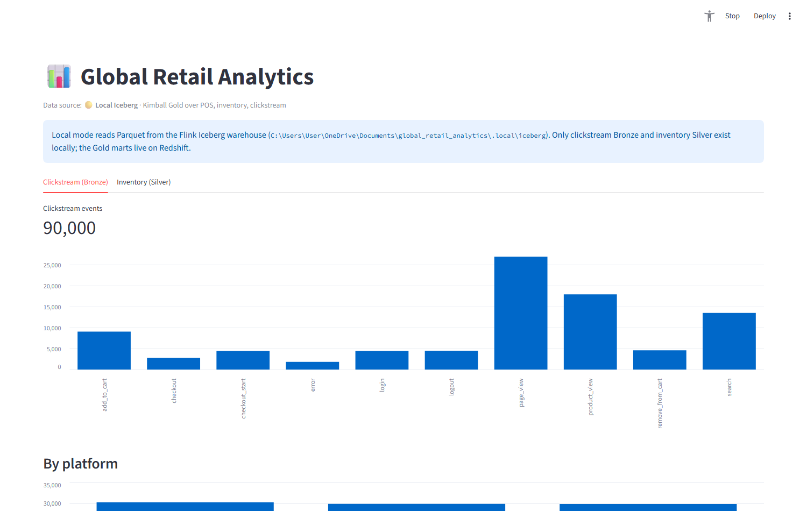
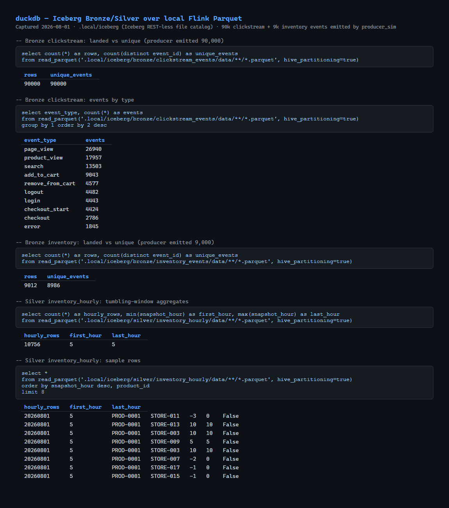
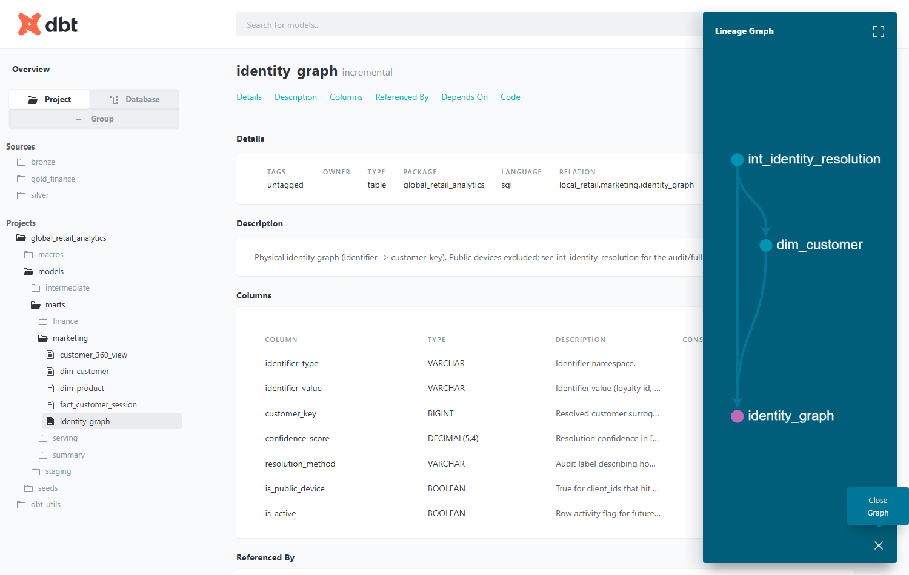
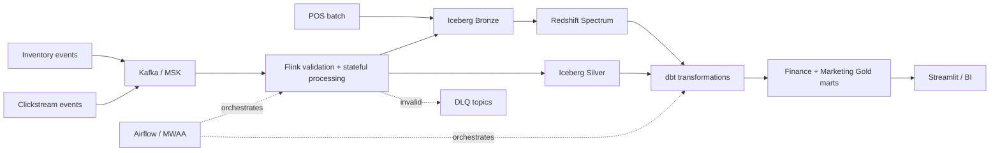

[](https://github.com/jerry98s/global_retail_analytics/actions/workflows/ci.yml)

# Global Retail Analytics Platform

A runnable data-engineering portfolio project: real-time inventory and
clickstream ingestion, governed finance and Customer 360 marts, and a local
Docker/DuckDB path that does not require an AWS account.

**Stack:** Kafka · Flink · Iceberg · Redshift · dbt · Airflow · Great
Expectations · Terraform · Streamlit

## Verified end-to-end

From the latest full local run (2026-08-01, fresh volumes — raw evidence in
[docs/evidence](./docs/evidence/README.md)):

| Stage | Result |
|---|---|
| Streaming ingestion | 90,000 clickstream events emitted → **90,000/90,000 landed in Iceberg Bronze** (0 lost, 0 duplicates, 0 DLQ) · 9,000 inventory events landed (injected retry-duplicates aside) |
| Batch | 1,480 POS line items → 1,480 `finance.fact_sales` rows (exact 1:1) |
| Transformation | **22/22 dbt models built · 134/134 dbt tests pass** |
| Data quality | **11/11 Great Expectations suites pass · 264/264 unit tests pass** in the full run |
| Identity / C360 | 123k identity edges resolved (loyalty match, session link, component anchor) → consent-gated Customer 360 serving view |

| | |
|:---:|:---:|
|  |  |
|  |  |

## Branches

| Branch | Role |
|---|---|
| **`main`** | Cloud-deployable AWS implementation (MSK, EMR, Redshift, MWAA); execution evidence is tracked separately. |
| **`local-testing-version`** | Local Docker Kafka/Flink + DuckDB testing and demos. |

Local-only compose bind-mounts and short Flink windows stay on
`local-testing-version`. Shared cloud logic is cherry-picked to `main` when
needed — see [docs/ENVIRONMENTS.md](./docs/ENVIRONMENTS.md).

## The problem

Retail teams need different guarantees from the same platform:

- Finance needs reconciled daily sales facts.
- Store operations needs fresh inventory snapshots.
- Marketing needs consent-aware identity resolution, sessions, and RFM scores.
- Engineers need replayable raw data, visible failures, and recovery procedures.

The design separates those workloads instead of forcing them into one database
or one latency target.

## What this demonstrates

| Capability | Evidence in the repository |
|---|---|
| Streaming ingestion | Kafka producers + PyFlink jobs (event-time, checkpoints, dedup, DLQ) |
| Lakehouse | Iceberg Bronze/Silver, partition contracts, compaction / snapshot expiry |
| Analytics engineering | dbt staging → intermediate → finance/marketing marts |
| Dimensional modelling | Kimball facts/dims; SCD Type 2 only on `dim_product` |
| Identity / C360 | Spark GraphFrames connected components (ADR-010), public-device exclusion, consent gate |
| Data quality | JSON Schema contracts, dbt tests, Great Expectations, pytest |
| Orchestration | Six Airflow DAGs (batch, C360, Flink, SCD2, GE, Iceberg maintenance) |
| Infrastructure | Terraform: S3, MSK, EMR, Redshift Serverless, MWAA, App Runner |
| Operations | ADRs + runbooks (replay, backfill, DLQ, consent, Kafka, Flink, Iceberg) |
| Governed Gold | Write-Audit-Publish (ADR-009): clone → audit → atomic publish |

## Architecture overview



Full design: [ARCHITECTURE.md](./ARCHITECTURE.md).

## Quick start

### Offline checks (matches CI)

Works on either branch. Prefer the project venv:

```powershell
uv sync --group dev
.\.venv\Scripts\python.exe -m pytest tests/unit/ -q -m unit
.\.venv\Scripts\python.exe -m ruff check ingestion streaming scripts quality orchestration
```

CI also runs Terraform fmt/validate, DuckDB identity-chain dbt +
`verify_local_identity.py`, and compose config checks — see
[`.github/workflows/ci.yml`](./.github/workflows/ci.yml).

### Full local platform (`local-testing-version`)

Prerequisites: Docker Desktop, PowerShell, [uv](https://docs.astral.sh/uv/).

```powershell
git checkout local-testing-version
uv sync --group dev

# Flink before simulate (Kafka latest-offset). Task all does this order.
.\scripts\local\run_local_stack.ps1 -Task all
```

- Kafka from the host: **`127.0.0.1:9092`** (not `localhost` on Docker Desktop).
- Flink UI: <http://localhost:8082> · Streamlit (optional): <http://localhost:8501>

<details><summary>Step by step, dbt source modes, and the optional local dashboard</summary>

```powershell
.\scripts\local\run_local_stack.ps1 -Task up
.\scripts\local\run_local_stack.ps1 -Task topics
.\scripts\local\run_local_stack.ps1 -Task flink
.\scripts\local\run_local_stack.ps1 -Task simulate
.\scripts\local\run_local_stack.ps1 -Task dbt          # -DbtSource iceberg (default)
.\scripts\local\run_local_stack.ps1 -Task quality
```

| Mode | Flag | What dbt reads |
|---|---|---|
| Fidelity (default) | `-DbtSource iceberg` | Flink Parquet under `.local/iceberg` + local POS Parquet; seeds only `dim_date` / `dim_store` |
| Fixture (CI identity) | `-DbtSource seeds` | Curated CSV under `seeds/bronze` (clickstream + pos identity scenarios) + `seeds/finance` reference dims |

```powershell
docker compose -f infra/docker/compose/docker-compose.yml `
  -f infra/docker/compose/docker-compose.dashboard.yml up -d --build dashboard
```

</details>

The runner copies `profiles.yml.example` → ignored `profiles.yml` and uses
DuckDB — no Redshift credentials required.

## Repo structure

| Path | Purpose |
|---|---|
| `ingestion/` | Schemas, Kafka topics/producers, POS Parquet generator |
| `streaming/` | Flink jobs + YAML config |
| `transformation/` | dbt project + Redshift DDL / Spectrum / serving views |
| `orchestration/` | Airflow DAGs + plugins |
| `quality/` | Great Expectations suites + pytest DQ integration tests |
| `tests/` | Offline unit + DuckDB integration tests |
| `metadata/` | Governed object + metric catalog (YAML) for `metadata.meta.*` |
| `infra/` | Docker Compose, Flink image, Terraform, EMR bootstrap |
| `scripts/local/` | Local stack runner (Iceberg→DuckDB loader and GE runner live on `local-testing-version`) |
| `scripts/cloud/` | Terraform wrapper, deploy, Redshift bootstrap, MSK producers |
| `dashboard/` | Streamlit (local Iceberg or Redshift) |
| `docs/` | Architecture, ADRs, data model, runbooks, evidence |
| `notebooks/` | Analysis notebooks (`.ipynb` only) |

## Key design decisions

| ADR | Topic |
|---|---|
| [ADR-001](./docs/decisions/ADR-001-table-format.md) | Why Iceberg |
| [ADR-002](./docs/decisions/ADR-002-batch-vs-stream.md) | Batch vs streaming boundaries |
| [ADR-003](./docs/decisions/ADR-003-identity-graph.md) | Customer identity graph |
| [ADR-004](./docs/decisions/ADR-004-cost-model.md) | Illustrative cost model |
| [ADR-005](./docs/decisions/ADR-005-warehouse-redshift.md) | Why Redshift Serverless |
| [ADR-006](./docs/decisions/ADR-006-flink-vs-spark.md) | Why Flink vs Spark Streaming |
| [ADR-007](./docs/decisions/ADR-007-inventory-kappa.md) | Inventory kappa path |
| [ADR-008](./docs/decisions/ADR-008-metadata-database.md) | Operational metadata DB |
| [ADR-009](./docs/decisions/ADR-009-write-audit-publish.md) | Write-Audit-Publish for Gold |
| [ADR-010](./docs/decisions/ADR-010-spark-graphframes-identity.md) | Spark GraphFrames for identity resolution |

Cost figures are planning scenarios, not observed cloud bills.

## Environments and deploy

| Flavour | Branch / where | Entry point |
|---|---|---|
| Local | `local-testing-version` | `scripts/local/run_local_stack.ps1` |
| Cloud dev/prod | `main` | `scripts/cloud/run_cloud_stack.ps1` (wraps `run_terraform.ps1` + `deploy_platform.ps1` + `bootstrap_redshift.ps1` + `run_msk_producers.ps1`) |

Local is the reproducible path: one command, no AWS account, no bill. Cloud is
fully coded in Terraform behind a single wrapper script, and is designed to be
stood up for a run and destroyed afterwards rather than left idle. Deploys are
manual by design — CI validates every push, but no workflow applies Terraform
or touches an AWS account.

On a fresh clone, fill in your own account-specific config first (all four are
gitignored — only the `*.example` templates ship in the repo):

```powershell
cd infra\terraform\bootstrap
copy terraform.tfvars.example terraform.tfvars      # state_bucket_name + budget_alert_email
cd ..\envs
copy dev.backend.hcl.example dev.backend.hcl        # bucket = your state bucket
copy dev.tfvars.example dev.tfvars                  # VPC, subnets, Redshift password
cd ..\..\..
```

```powershell
# Cloud (AWS account required) - one wrapper, -Task all = full fresh deploy (dev)
.\scripts\cloud\run_cloud_stack.ps1 -Task all
.\scripts\cloud\run_cloud_stack.ps1 -Task deploy          # after code changes
.\scripts\cloud\run_cloud_stack.ps1 -Task verify          # post-deploy smoke checks
```

<details><summary>Prod apply and per-script flags (siblings of the wrapper)</summary>

```powershell
.\scripts\cloud\run_cloud_stack.ps1 -Task apply -Env prod -AutoApprove
.\scripts\cloud\run_terraform.ps1 -Stack bootstrap -Action apply
.\scripts\cloud\run_terraform.ps1 -Stack platform -Env dev -Action apply
.\scripts\cloud\deploy_platform.ps1 -Env dev
```

</details>

### Cost and teardown

`-Task all` creates billable AWS infrastructure — MSK, EMR, Redshift Serverless,
MWAA, and App Runner. Destroy the platform stack when a session is finished:

```powershell
.\scripts\cloud\run_terraform.ps1 -Stack platform -Env dev -Action destroy
```

The bootstrap stack (state bucket, lock table, budget alarm) is negligible and
can stay in place between sessions.

For a guided lowest-cost end-to-end run (no MWAA/dashboard, laptop-driven dbt
and GE, evidence capture, destroy checklist), follow
[docs/runbooks/dev-cloud-test-run.md](./docs/runbooks/dev-cloud-test-run.md).

Details: [ENVIRONMENTS.md](./docs/ENVIRONMENTS.md), [REDSHIFT.md](./docs/REDSHIFT.md),
[scripts/README.md](./scripts/README.md). Use `*.tfvars.example` /
`*.backend.hcl.example` / `profiles.yml.example` — do not commit real
credentials, account IDs, or VPC IDs.

## Local testing deep-dives

| Topic | Where |
|---|---|
| Iceberg Parquet queries | [local-data-queries.md](./docs/runbooks/local-data-queries.md), notebook `01_data_walkthrough` (on `local-testing-version`) |
| Identity scenarios (seeds) | `.\scripts\local\run_local_stack.ps1 -Task dbt -DbtSource seeds` then `python tests/integration/verify_local_identity.py` |
| Flink ops | [flink-operations.md](./docs/runbooks/flink-operations.md) |
| Evidence / benchmarks | [docs/evidence/README.md](./docs/evidence/README.md) |

Offline pytest + ruff prove static quality. They do **not** claim a completed
AWS production deployment or a measured 10k events/s load test.

## Data model

| Consumer | Product | Grain |
|---|---|---|
| Finance | `finance.fact_sales` | `(transaction_id, line_item_number)` |
| Ops | `finance.fact_inventory_snapshot` | product/store/hour |
| Marketing | `marketing.fact_customer_session` | `session_id` |
| Marketing | `marketing.dim_customer` | `customer_key` + RFM/consent |
| BI | `serving.customer_360_serving` | consent-gated Customer 360 |

- SCD Type 2 **only** on `dim_product`.
- Identity: deterministic graph; public devices excluded from C360 merges —
  [identity-resolution.md](./docs/data-model/identity-resolution.md).
- Full grains/ERD: [dimensional-model.md](./docs/data-model/dimensional-model.md).

## Suggested portfolio walkthrough

1. Start with the three business latency requirements.
2. Explain why inventory has a kappa path while finance remains batch.
3. Show one invalid event reaching a DLQ.
4. Walk through product SCD2 and identity-resolution tests.
5. Open the Streamlit dashboard and Flink checkpoint view.
6. Close with recovery procedures, cost assumptions, and known limits.

Current verification baselines are deliberately separated: the latest full
local E2E run (2026-08-01) includes 264 unit tests, while the newer offline
regression runs (2026-08-16) pass 291 tests on `main` and 306 tests on
`local-testing-version`. See [docs/evidence](./docs/evidence/README.md) for the
dated evidence ledger.

## License

[MIT](./LICENSE)
