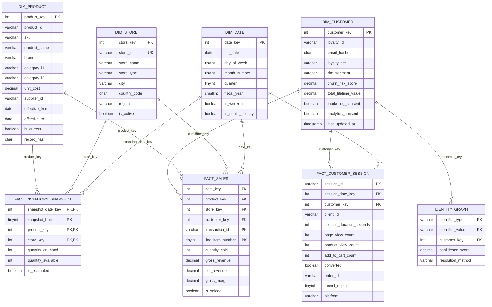

# Data Model ERD

This diagram is the repo-native ERD for the Global Retail Analytics dimensional
model. It can be viewed directly in Cursor/GitHub as Mermaid, while
`erd.dbml` can be pasted into dbdiagram.io for a Lucidchart-style canvas.

## Diagram Files

- `erd.md`: Mermaid ERD for Cursor/GitHub rendering.
- `erd.dbml`: DBML version for dbdiagram.io or Lucidchart-style editing.
